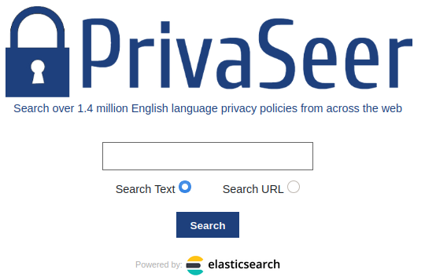
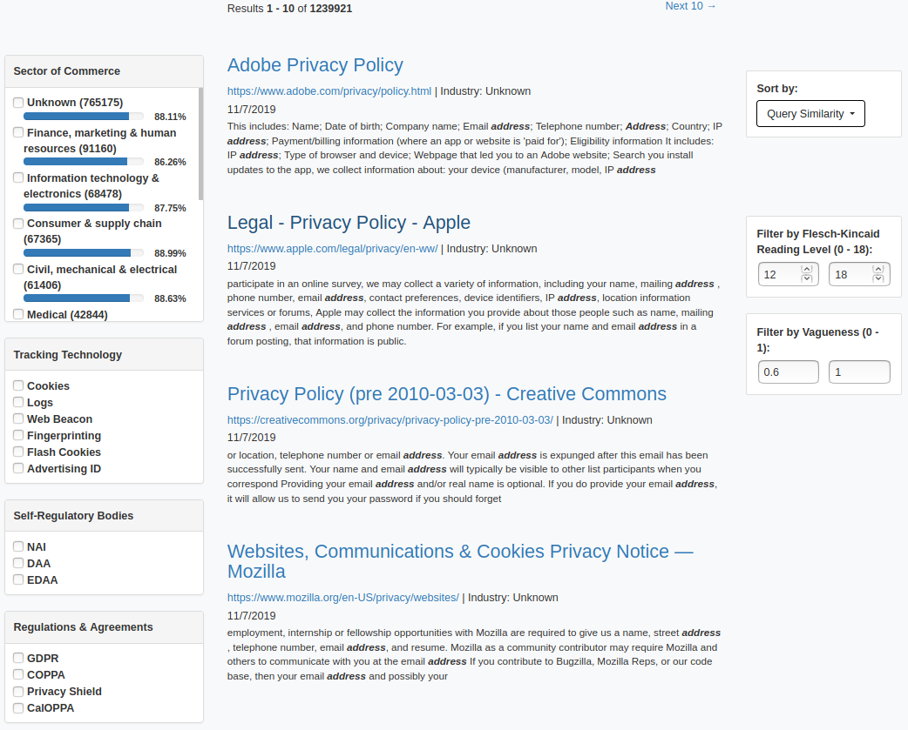

# PrivaSeer: A Large-Scale Privacy Policy Search Engine

To address the lack of a publicly accessible large-scale privacy policy resource, we present **PrivaSeer**\footnote{https://privaseer.ist.psu.edu/}, a privacy policy search engine that currently indexes 1,400,318 privacy policies collected from the web. PrivaSeer can be used to find policies based on policy text using facets such as sector of commerce, policy vagueness, policy readability, tracking technology mentioned, regulatory bodies mentioned, and regulations or cross-border agreements mentioned in the policy text. Search results can be ranked by popularity of the website of the policy, relevance based on the query, and the probability that a document is a privacy policy. To the best of our knowledge, PrivaSeer is the first search engine specifically designed to support privacy research.

## Implementation Details
PrivaSeer is implemented as a Django project and uses Elasticsearch for indexing and searching privacy policies.

## Access PrivaSeer
Visit [PrivaSeer](https://privaseer.ist.psu.edu/) to access the search engine.

## Screenshots

*Figure 1: Snapshot of the landing page of PrivaSeer*


*Figure 2: Snapshot of the search results page of PrivaSeer*

## Citation

```
@inproceedings{srinath2021privaseer,
  title={PrivaSeer: A Privacy Policy Search Engine},
  author={Srinath, Mukund and Sundareswara, Soundarya Nurani and Giles, C Lee and Wilson, Shomir},
  booktitle={International Conference on Web Engineering},
  pages={286--301},
  year={2021},
  organization={Springer}
}
```
